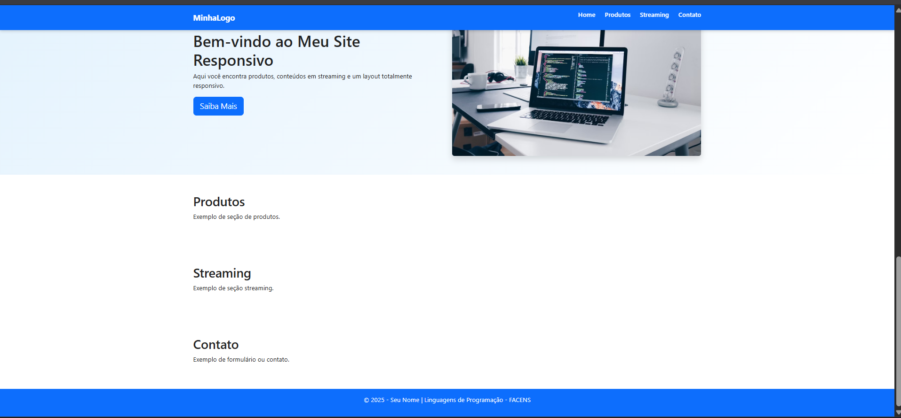
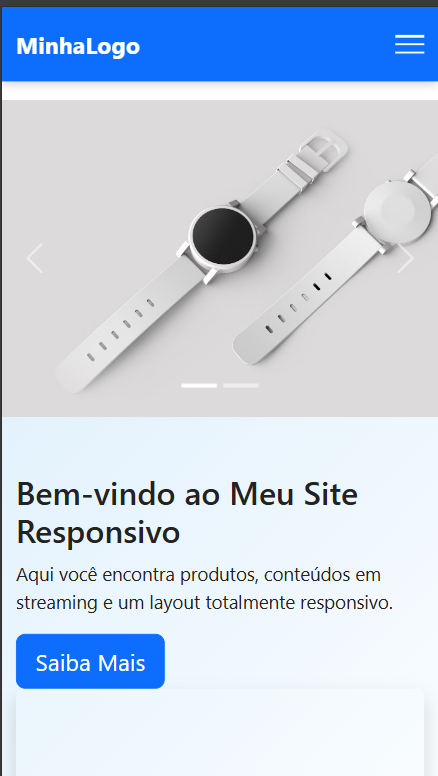
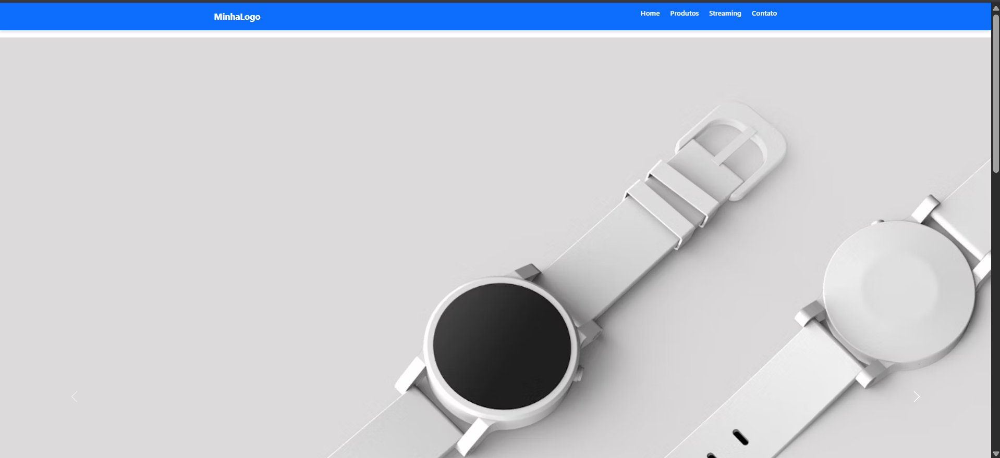

# 📘 Atividade Prática – Front-End | Menu Responsivo + Carrossel

**Disciplina:** Linguagens de Programação – AS009TSN1 
**Tema:** Desenvolvimento Front-End com HTML, CSS, JavaScript e Bootstrap
**Prazo de Entrega:** 15/11/2025

## 🧑‍💻 Descrição da Atividade

Este projeto faz parte da atividade prática da disciplina de Linguagens de Programação e tem como objetivo aplicar os conceitos de desenvolvimento Front-End utilizando HTML5, CSS3, JavaScript e Bootstrap 5.

A proposta é criar uma página responsiva contendo:

- Cabeçalho fixo

- Menu responsivo com botão hamburguer

- Carrossel de imagens

- Banner principal

- Seções estruturadas (Home, Produtos, Streaming e Contato)

---

## 📝 Requisitos Atendidos

- ✅ **Cabeçalho (Header)** com links para redes sociais usando ícones do Font Awesome.
- ✅ **Banner Principal** com:
  - Imagem da comida favorita.
  - Título e breve descrição.
  - Botão com link “Saiba Mais”.
- ✅ **Estilização com CSS:**
  - Fundo colorido no banner com sobreposição.
  - Texto centralizado com sombra.
  - Efeito de zoom ao passar o mouse sobre a imagem.
- ✅ **Responsividade:** Garantida com classes do Bootstrap.

---

## 📂 Estrutura de Pastas 
```
atividade-js-menu-facens/
├── index.html
├── css/
│   └── style.css
├── js/
│   └── menu.js
└── img/
    ├── captura1.png
    ├── captura2.png
    ├── captura3.png
    └── captura4.png
```
---

## 💡 O que foi aprendido

- Montar a estrutura básica de páginas HTML5
- Criar e organizar estilos em CSS externo
- Implementar comportamento com JavaScript
- Construir um menu responsivo “hambúrguer”
- Incluir carrossel com Bootstrap 5
- Trabalhar com responsividade usando media queries
- Organizar arquivos e diretórios de um projeto web

---

## ✅ Tecnologias Utilizadas

- HTML5
- CSS3
- JavaScript
- Bootstrap 5

---

## 📸 Prévia do Projeto

> *Link da Hospedagem: minhacomidafavorita.netlify.app*






---

## 📎 Autor

Desenvolvido por **André Vitor - ANDRECODEDEV** 👨‍💻  
Turma: AS009TSN1  
